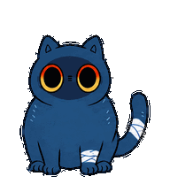
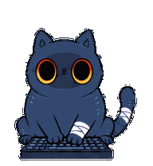
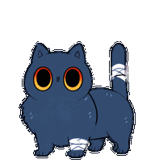
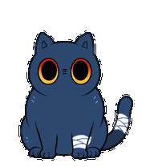

# 芝麻酥 · Blade Cat

一只陪你写代码的蓝灰色猫猫，适用于支持自定义 v2 宠物的 Codex 桌面应用。

圆脸、大眼睛、上红下金的眼缘，身体带一点炸毛，左前腿和尾巴缠着白色绷带。

| 安静蹲坐 | 工作敲键盘 | 完成后摇尾巴 | 等待回应 |
| :---: | :---: | :---: | :---: |
|  |  |  |  |

## 下载与安装

**[下载芝麻酥安装包](https://github.com/Christinesbt/blade-cat/raw/refs/heads/main/downloads/zhimasu.zip)**

1. 下载并解压 ZIP，得到 `zhimasu` 文件夹。
2. 将整个文件夹放到 Codex 的 `pets` 目录中：
   - Windows：`%USERPROFILE%\.codex\pets\`
   - macOS：`~/.codex/pets/`
   - 如果自定义了 `CODEX_HOME`，使用该目录下的 `pets/`。
3. 确认文件结构如下；不要多套一层同名文件夹。
4. 在 Codex 的宠物选择列表中选择「芝麻酥」。如果没有出现，等当前任务结束后彻底退出并重新打开 Codex。

```text
pets/
└── zhimasu/
    ├── pet.json
    └── spritesheet.webp
```

也可以通过仓库页面的 **Code → Download ZIP** 下载整个仓库，再复制其中的 `zhimasu` 文件夹。

## 动作

- 默认闲置：安静蹲坐、眨眼和轻微呼吸。
- 工作：两只前爪交替敲键盘。
- 完成结果提示：四只脚站稳，抬头摇尾巴。
- 等待回应：轻抬前爪，保留两侧后腿。
- 其他：左右小跑、打招呼、跳跃、低落，以及 16 个方向的注视。

吃猫粮暂留作后续动作，当前版本不包含。

GIF 展示动作素材；实际触发、播放次数和鼠标交互由 Codex 控制。本包不修改应用程序。制作时核对的 Windows 版本为 `26.901.6511.0`：工作与完成提示动作播放三轮后回到闲置，不会持续整个任务。其他版本的行为可能不同。

## 文件与验证

- `zhimasu/`：安装所需的两个文件。
- `downloads/zhimasu.zip`：相同文件的便携安装包。
- `previews/`：九组动作与注视预览。
- `SHA256SUMS`：安装文件与 ZIP 的 SHA-256 校验值。

图集采用 v2 格式：1536 × 2288 像素，8 列 × 11 行，每格 192 × 208。包含 57 个常规动作帧、16 个方向帧及 1 个中立帧。格式、透明背景及核心动作保留检查已通过；所有场景的应用内触发尚未逐项验收。

若包括内置宠物在内都无法拖动，可先在当前任务结束后重启 Codex。制作环境也遇到过此问题，原因尚未确定。

## 角色来源

本项目是基于《崩坏：星穹铁道》角色「刃」及「小不点猫猫」芝麻酥形象制作的非官方同人宠物，动画素材使用 AI 辅助制作。原角色及相关形象权利归原权利人所有，与官方无隶属关系。
